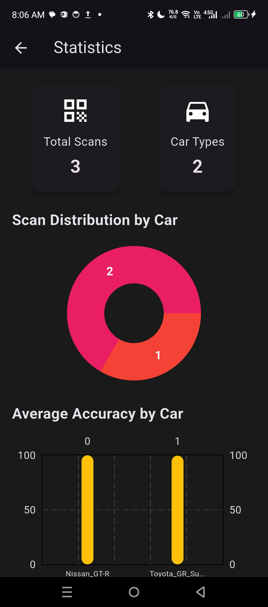
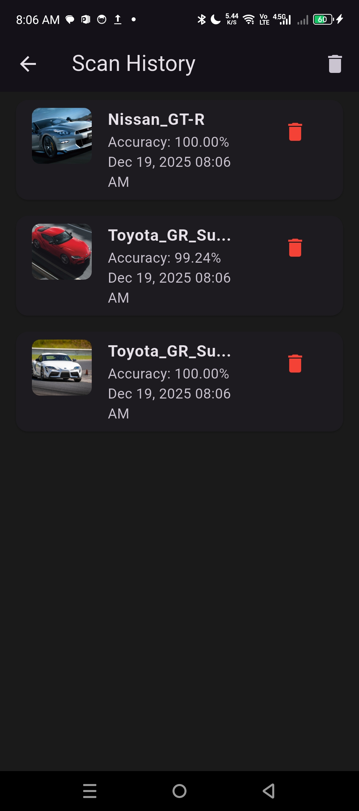

---

### 👨‍💻 Mike Cedrick Musico Tisbe  
**BSIT Student · Software Development · Systems & Applications · Database & Networking · Programming**

---

## 🚀 About Me

I'm Mike Cedrick, a BSIT student who learns best by building practical projects.
I work with Flutter, web technologies, and databases, and I use GitHub to document my progress and improve my development skills.

🌱 Currently improving my Flutter UI, web development, and database management

🧩 I enjoy breaking down complex problems into clear, manageable steps

🎯 Long-term goal: become a full-stack developer capable of building and deploying complete applications

---

## 🧰 Skills and Technologies

### Programming Languages

### Frontend Development

### Backend & Database

### Mobile Development

### Tools & Platforms

---

## 📱 Sports Car Identifier App

My featured mobile project is a **Sports Car Identifier**, built with **Flutter** and a **TensorFlow Lite model**.

- **Purpose**: Help users identify sports car models quickly using their phone.
- **Core Features**:
  - 📷 **Scan & Identify** cars from photos
  - 🧠 **On‑device ML model** using `.tflite` and `labels.txt`
  - 📊 **History & Analytics** to review previous scans
  - 🎨 **Modern, minimal UI** focused on clarity and ease of use

---

## 🖼️ App Screens (UI Preview)

| Home | Scan | Analytics | History |
|:----:|:----:|:---------:|:-------:|
|  |  |  |  |

---

## 🚗 Sports Car Classes

| Car Model | Preview | Description |
|:----------|:-------:|:------------|
| **Toyota GR Supra** |  | A high-performance Toyota sports car with a turbocharged engine. |
| **Nissan GT-R** |  | A legendary Japanese sports car known for its twin-turbo V6. |
| **Ford Mustang** |  | An iconic American sports car famous for its power. |
| **Chevrolet Camaro** |  | A bold sports car offering strong performance. |
| **Mazda MX-5 Miata** |  | A lightweight roadster known for its excellent handling. |
| **Subaru BRZ** |  | A rear-wheel-drive coupe built for precision handling. |
| **Honda Civic Type R** |  | A high-performance hatchback with a track-focused design. |
| **Porsche 911 Carrera** |  | A luxury sports car combining performance and timeless design. |
| **BMW Z4 Roadster** |  | A premium convertible sports car with modern performance. |
| **Lamborghini Huracan** |  | A V10-powered supercar with extreme performance and design. |

---

## 💼 Other Featured Projects

| Project | Description | Tech Stack | Repository |
|:--------|:------------|:-----------|:-----------|
| **IT120 Activities** | Activity 1 - Git and GitHub | `Python` | [View Repo](https://github.com/mynameismikeyy/Tisbe_IT120_Act1) |
| **IT108 Web Projects** | Web development activities and fundamentals | `HTML` `CSS` `JavaScript` | [View Repo](https://github.com/mynameismikeyy/Tisbe_IT108) |
| **IT108 Quiz Projects** | Quiz and practice projects for IT108 | `Web` | [View Repo](https://github.com/mynameismikeyy/Tisbe_IT108/tree/master/TISBE_QUIZ) |
| **Flutter Widget Components** | Reusable Flutter UI components and widgets | `Flutter` `Dart` | [View Repo](https://github.com/mynameismikeyy/Flutter_Widget_UIComponents) |
| **MySQL Trigger Projects** | MySQL trigger implementation and automation | `MySQL` `Database` | [View Repo](https://github.com/mynameismikeyy/mysql-trigger-implementation-tisbe) |
| **Final Project** | Tisbe_Sports_Car_Classification_FinalProject | `Multiple Technologies` | [View Repo](https://github.com/mynameismikeyy/Tisbe_Sports_Car_Classification_FinalProject) |
| **IT108 FINAL DEFENSE** | FINAL DEFENSE Farmer_Training_Certification_Registry | `MySQL` `Database` | [View Repo](https://github.com/mynameismikeyy/TISBE_HECHANOVA_IT108_FINAL_DEFENSE.git) |
| **IT120 FINAL PROJECT** | APPLICATION SPORTS CAR | `MySQL` `Database` | [View Repo](https://github.com/mynameismikeyy/mynameismikeyy.git) |
| **IT120 FINAL PROJECT** | Final Project | Presentation and Submission | `MySQL` `Database` | [View Link](https://youtu.be/hmmVFwtPgTg?si=hpv0o7NLGiMzUF0l) |

---

## 📊 GitHub Stats

<!-- Main stats -->

<!-- Top languages -->

---

## 🎯 Learning Roadmap

- 📱 Build more **Flutter** apps with better navigation and state management  
- ☁️ Connect apps to **Firebase** (auth & database)  
- 🌐 Improve **responsive web design** and UI/UX  
- 🗄️ Practice **database design** and more complex SQL queries  

---

✨ **Thanks for visiting my profile!**  
Feel free to explore my repositories and follow my journey:  
👉 [github.com/mynameismikeyy](https://github.com/mynameismikeyy)

